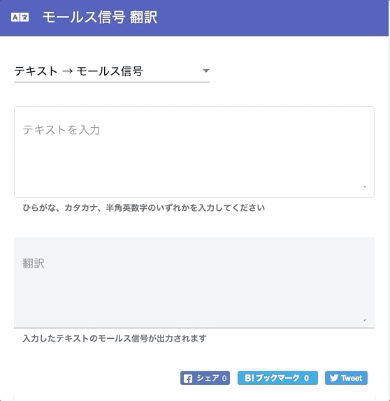

# MorseCode Translate Website([Try It](https://l08084.github.io/morse-code-translate-website/))



## Run Things Locally

```bash
git clone https://github.com/l08084/morse-code-translate-website
cd morse-code-translate-website
npm install -g @angular/cli
npm install
ng serve
# open your browser on http://localhost:4200/
```
